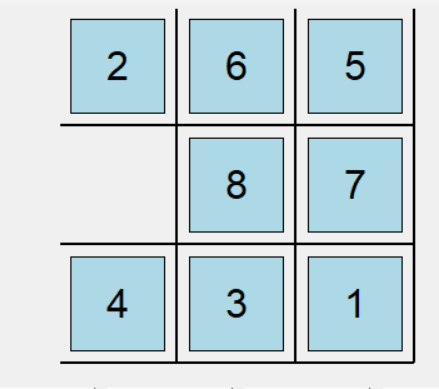
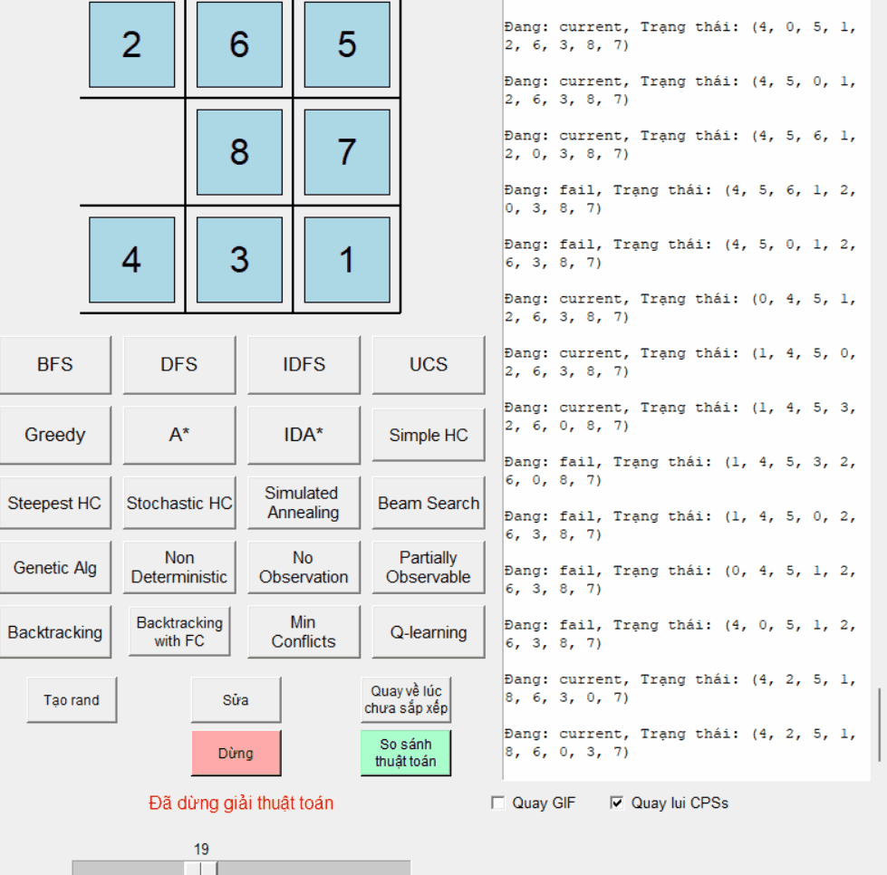
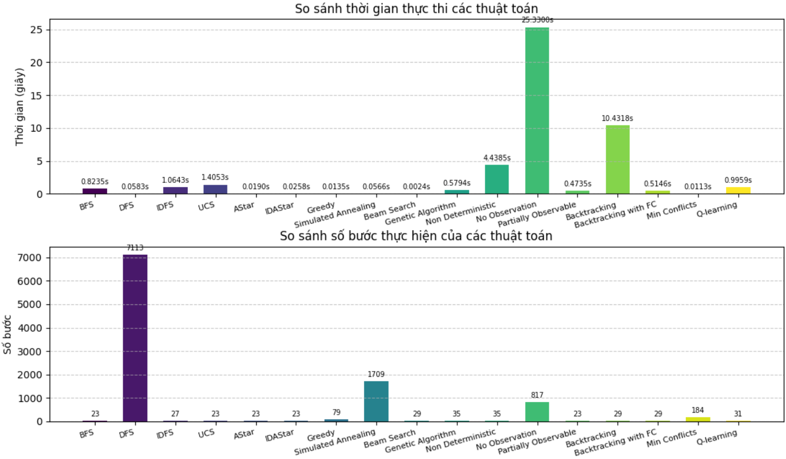

# HuynhNgocThang_23110327_DoAnAI

# Đồ Án Cá Nhân Môn Trí Tuệ Nhân Tạo - HKII - 2024 - 2025

## Huỳnh Ngọc Thắng - 23110327

### 1. Mục tiêu:

Trong đồ án cá nhân, các nhóm thuật toán tìm kiếm trong Trí tuệ nhân tạo được nghiên cứu và áp dụng nhằm giải quyết bài toán 8-puzzle – một bài toán cổ điển thể hiện rõ đặc trưng của việc tìm kiếm lời giải trong không gian trạng thái. Cụ thể, đề tài tập trung vào 6 hệ thống các thuật toán tìm kiếm, mỗi nhóm đóng góp một góc nhìn khác nhau vào quá trình khám phá không gian trạng thái:

- Thuật toán tìm kiếm không có thông tin (Uninformed Search) – bao gồm các phương pháp như BFS, DFS, IDFS và UCS – cho phép ta khảo sát toàn bộ không gian một cách tuần tự, đảm bảo tìm ra lời giải ngay cả khi không có bất kỳ gợi ý nào về hướng đi tối ưu.;
- Thuật toán tìm kiếm có thông tin (Informed Search), tiêu biểu là A*, IDA* và Greedy Best-First Search. Nhờ hàm heuristic, các phương pháp này rút ngắn đáng kể con đường tìm kiếm, đặc biệt hữu ích với những bài toán có không gian trạng thái lớn;
- Thuật toán tìm kiếm cục bộ (Local Search) như Hill Climbing (với các biến thể Steepest Ascent, Simple Hill Climbing, Stochastic Hill Climbing), Simulated Annealing và Beam Search không cần lưu trữ toàn bộ cây trạng thái mà tập trung vào việc cải thiện nghiệm hiện tại, rất phù hợp với bài toán tối ưu hóa;
- Trong những môi trường phức tạp hoặc không chắc chắn, các tìm kiếm như Non Deterministic (AND-OR Graph Search), No Observation (Belief State) hay Partially Observable mở rộng khả năng ứng dụng của AI, cho phép giải quyết các bài toán động, có thông tin quan sát hạn chế hoặc hoàn toàn không có cảm biến;
- Nhóm thuật toán Constraint Satisfaction Problems (CSP) sử dụng các chiến lược Min-conflicts, Forward-Checking và Backtracking, Backtracking để biểu diễn và giải quyết bài toán 8-puzzle dưới dạng ràng buộc logic, đồng thời làm nổi bật vai trò của việc đưa thêm các điều kiện tiền xử lý vào quá trình tìm kiếm;
- Học tăng cường (Reinforcement Learning) với Q-learning, cho phép một tác nhân học tập trực tiếp thông qua tương tác với môi trường, dần khám phá và tối ưu hóa chính sách hành động mà không cần biết trước cấu trúc không gian trạng thái.

Việc triển khai và so sánh các nhóm thuật toán này không chỉ giúp đánh giá hiệu quả của từng phương pháp mà còn mở ra các hướng tiếp cận đa dạng, góp phần làm phong phú thêm ứng dụng của Trí tuệ nhân tạo trong giải quyết các bài toán tìm kiếm.

### 2. Nội dung

#### _2.1. Uninformed Search Algorithms_

Một **bài toán tìm kiếm** trong Trí tuệ Nhân tạo thường bao gồm sáu thành phần cơ bản:

1. **Không gian trạng thái (State space):** Tập hợp tất cả các trạng thái khả dĩ.
2. **Trạng thái khởi đầu (Initial state):** Điểm xuất phát ban đầu.
3. **Trạng thái đích (Goal state):** Mục tiêu cần đạt tới.
4. **Hàm chuyển đổi (Transition function):** Quy tắc biến đổi giữa các trạng thái.
5. **Hàm kiểm tra đích (Goal test):** Cơ chế xác định xem trạng thái hiện tại có phải là đích hay không.
6. **Chi phí (Cost function):** Giá trị chi phí để đi từ trạng thái này sang trạng thái khác (nếu có).

**Solution** (giải pháp) là chuỗi hành động (hoặc trạng thái) dẫn từ trạng thái khởi đầu đến trạng thái đích, thỏa mãn điều kiện của bài toán.

##### Nhận xét

- **BFS (Breadth-First Search):**

  - BFS hoạt động bằng cách duyệt các trạng thái theo từng lớp, từ gần đến xa, giống như các gợn sóng lan tỏa từ một điểm

  - Ưu điểm: Luôn tìm ra đường đi ngắn nhất (theo số bước).
  - Nhược điểm: Tốn nhiều bộ nhớ và thời gian khi số lượng trạng thái tăng cao.
    

- **DFS (Depth-First Search):**

  - DFS hoạt động theo nguyên tắc ngược lại với BFS - nó ưu tiên duyệt theo chiều sâu nhất có thể trước khi quay lui
  - Điểm quan trọng là chúng ta sử dụng một ngăn xếp (stack) và lấy phần tử cuối cùng ra (LIFO - Last In First Out), khác với BFS. Điều này làm cho DFS đi sâu xuống một nhánh tìm kiếm trước khi thử các nhánh khác.
  - Trong bài toán 8-puzzle, DFS thường kém hiệu quả hơn các thuật toán khác vì không gian trạng thái khá rộng, nhưng nhiều nhánh không dẫn đến đích.

  - Ưu điểm: Dùng ít bộ nhớ, dễ triển khai.
  - Nhược điểm: Dễ mắc kẹt trong vòng lặp, không đảm bảo tối ưu, kém hiệu quả trên không gian lớn như 8-puzzle.
    

- **IDFS (Iterative Deepening DFS):**

  - IDFS thực hiện DFS với độ sâu giới hạn tăng dần, giúp vừa tìm được lời giải ngắn nhất như BFS, vừa tiết kiệm bộ nhớ như DFS
  - IDFS có hai thành phần chính: Hàm dfsGioiHan thực hiện DFS với giới hạn độ sâu cho trước, vòng lặp bên ngoài tăng dần độ sâu giới hạn từ 1 đến giới hạn tối đa

  - Ưu điểm: Kết hợp ưu điểm của DFS (thấp bộ nhớ) và BFS (tìm ngắn nhất về số bước).
  - Nhược điểm: Phải lặp lại nhiều lần, thường chậm hơn khi không dùng heuristic.
    

- **UCS (Uniform-Cost Search):**

  - Thuật toán UCS - Uniform-Cost Search là phiên bản tổng quát hơn của BFS, xét đến chi phí thực của đường đi.
  - Điểm đặc biệt của UCS là sử dụng hàng đợi ưu tiên (priority queue) thay vì hàng đợi thông thường. Mỗi phần tử trong hàng đợi bao gồm (chi phí, trạng thái, đường đi), và thuật toán luôn lấy ra phần tử có chi phí thấp nhất để xét tiếp.

  - Ưu điểm: Xét chi phí thực, đảm bảo tìm giải pháp ít tốn kém nhất.
  - Nhược điểm: Tương tự BFS, khả năng bùng nổ tổ hợp lớn, chậm với bài toán 8-puzzle.
    

**Tóm lại:**  
Các thuật toán không có thông tin định hướng tuy đơn giản và “đảm bảo” tìm ra giải pháp, nhưng khi áp dụng cho các bài toán có không gian trạng thái lớn như 8-puzzle thì dễ gặp vấn đề về thời gian và bộ nhớ do thiếu cơ chế heuristic dẫn đường.

#### _2.2. Informed Search Algorithms_

Khi có thêm **thông tin định hướng** (heuristic), các thuật toán tìm kiếm không chỉ dừng lại ở việc duyệt hết không gian trạng thái mà còn ưu tiên những hướng đi hứa hẹn nhất. Điều này giúp cải thiện đáng kể hiệu suất và khả năng mở rộng, đặc biệt với những bài toán phức tạp như 8-puzzle.

##### Nhận xét

- **Greedy Best-First Search**

  - Thuật toán Greedy Best-First Search là bước đầu tiên khi chúng ta đưa thông tin heuristic vào quá trình tìm kiếm.
  - Greedy chỉ xét heuristic (h(n)) - chính là ước lượng khoảng cách đến đích - mà không quan tâm đến chi phí đã bỏ ra.

  - Chỉ dựa vào heuristic \(h(n)\) để chọn nốt mở rộng tiếp theo, ưu tiên nhanh “cảm giác” gần mục tiêu.
  - Tuy đạt tốc độ cao, Greedy dễ mắc kẹt tại cực tiểu cục bộ và không đảm bảo tối ưu.
    

- **A\***

  - A\* là thuật toán tìm kiếm có thông tin nổi tiếng nhất, kết hợp hoàn hảo giữa chi phí đã đi (g(n)) và ước lượng chi phí còn lại (h(n)).
  - Điểm khác biệt quan trọng với Greedy là A\* cân nhắc cả chi phí đã đi (g) và ước lượng còn lại (h). Ngoài ra, A\* còn có cơ chế "tái mở": nếu tìm được đường đi tốt hơn đến một trạng thái (g_moi < daDuyet[trangThaiKe]), sẽ cập nhật và xét lại trạng thái đó.

  - Kết hợp chi phí đường đi \(g(n)\) và ước lượng còn lại \(h(n)\) để đánh giá \(f(n) = g(n) + h(n)\).
  - Với heuristic nhất quán, A\* đảm bảo tìm ra lời giải ngắn nhất (theo chi phí) và thường là phương pháp hiệu quả nhất cho 8-puzzle.
    

- **IDA\***

  - IDA\* (Iterative Deepening A) kết hợp ý tưởng của IDFS và A\*, giải quyết vấn đề bộ nhớ của A\*.
  - IDA\* hoạt động bằng cách:

  1. Bắt đầu với ngưỡng f ban đầu là giá trị heuristic của trạng thái xuất phát
  2. Thực hiện tìm kiếm theo chiều sâu, nhưng cắt tỉa các nhánh có f > bound
  3. Nếu không tìm thấy đích, tăng ngưỡng lên giá trị f nhỏ nhất vượt ngưỡng hiện tại
  4. Lặp lại cho đến khi tìm thấy đích hoặc xác định không có lời giải

  - Phiên bản cải tiến của A\*, kết hợp iterative deepening với chỉ số ngưỡng \(f\).
  - Giữ nguyên tính tối ưu, tiết kiệm bộ nhớ hơn A\* nhưng có thể tăng số lần duyệt lại và kéo dài thời gian chạy.
    

**Tóm lại:**  
Nhờ heuristic, các thuật toán có thông tin định hướng giảm mạnh không gian tìm kiếm so với Uninformed Search. Trong đó, A\* vẫn là lựa chọn hàng đầu khi bộ nhớ cho phép, Greedy phù hợp khi ưu tiên tốc độ, còn IDA\* là giải pháp thay thế lý tưởng khi tài nguyên nhớ hạn chế.

#### _2.3. Local Search_

**Tìm kiếm cục bộ** (Local Search) không lưu trữ toàn bộ cây trạng thái mà chỉ tập trung vào việc cải thiện nghiệm hiện tại thông qua các thao tác lân cận (neighbor operations). Phương pháp này phù hợp với các bài toán tối ưu hóa khi ta cần nhanh chóng tìm một lời giải “đủ tốt” trong không gian trạng thái lớn.

#### _Nhận xét:_

- **Hill Climbing** (Steepest Ascent, Simple, Stochastic):

  - Hill Climbing là thuật toán tìm kiếm cục bộ đơn giản, liên tục cải thiện trạng thái hiện tại theo hướng tốt hơn, giống như leo lên đỉnh đồi.

  - Ưu điểm của Hill Climbing là triển khai đơn giản, tốc độ nhanh và tiết kiệm bộ nhớ vì chỉ cần lưu trữ trạng thái hiện tại và các trạng thái lân cận.
  - Nhược điểm lớn nhất là dễ bị kẹt ở cực tiểu cục bộ (local minimum), tức là những trạng thái mà tất cả láng giềng đều kém hơn nhưng chưa phải là đích. Trong bài toán 8-puzzle, các biến thể Hill Climbing thường không tìm được lời giải cho tất cả các trạng thái ban đầu.
  - Mỗi biến thể có ưu nhược điểm riêng:
    1. Simple Hill Climbing nhanh nhất nhưng dễ bị kẹt nhất
    2. Steepest Hill Climbing tìm được đường đi tốt hơn nhưng tốn thời gian hơn để xét tất cả láng giềng
    3. Stochastic Hill Climbing có khả năng thoát khỏi một số cực tiểu cục bộ nhỏ nhờ yếu tố ngẫu nhiên

- **Simulated Annealing**:

  - Simulated Annealing khắc phục nhược điểm của Hill Climbing bằng cách đôi khi chấp nhận trạng thái xấu hơn, giống như quá trình ủ kim loại.
  - Điểm đặc biệt của Simulated Annealing là xác suất chấp nhận trạng thái xấu hơn phụ thuộc vào:
  - Mức độ xấu đi (delta_E) - càng xấu đi nhiều, xác suất chấp nhận càng thấp
  - Nhiệt độ (T) - khi mới bắt đầu (T cao), thuật toán sẵn sàng thử các hướng đi khác nhau; khi gần kết thúc (T thấp), thuật toán gần như chỉ chấp nhận cải thiện

  - Ưu điểm: Khả năng tìm kiếm toàn cục tốt hơn hill climbing.
  - Nhược điểm: Cần xác định lịch làm nguội (cooling schedule) hợp lý, độ phức tạp tính toán tăng.
    

- **Beam Search**:

  - Beam Search cân bằng giữa chiều rộng và chiều sâu bằng cách giữ lại một số lượng giới hạn trạng thái tốt nhất ở mỗi bước.

  - Giữ lại một số (beam width) trạng thái tốt nhất tại mỗi bước, kết hợp giữa breadth và depth.
  - Ưu điểm: Cân bằng bộ nhớ và tốc độ, linh hoạt chọn beam width.
  - Nhược điểm: Nếu beam width quá nhỏ vẫn có thể bỏ lỡ nghiệm tốt.
    

- **Genetic Algorithm**:

  - Thuật toán di truyền bao gồm nhiều bước quan trọng:

  1. Tạo quần thể ban đầu (create_initial_population): Tạo quần thể bằng cách thực hiện nhiều bước di chuyển ngẫu nhiên từ trạng thái ban đầu.
  2. Đánh giá độ thích nghi (calculate_fitness): Mỗi cá thể được đánh giá bằng hàm heuristic. Giá trị càng thấp càng tốt.
  3. Chọn cha mẹ (select_parents): Các cá thể có độ thích nghi tốt có cơ hội được chọn làm cha mẹ cao hơn.
  4. Lai ghép (crossover): Tạo con mới bằng cách kết hợp thông tin từ hai cha mẹ.
  5. Đột biến (mutate): Đôi khi biến đổi ngẫu nhiên một cá thể để tạo đa dạng di truyền.
  6. Tiến hóa qua các thế hệ (create_new_generation): Thuật toán giữ lại một số cá thể tốt nhất (elite) và tạo cá thể mới qua lai ghép, đột biến.

  - Dựa trên cơ chế di truyền học: khởi tạo quần thể, lai ghép, đột biến và chọn lọc.
  - Ưu điểm: Tìm lời giải đa dạng, dễ điều chỉnh cho không gian lớn.
  - Nhược điểm: Yêu cầu tính toán cao, cần tinh chỉnh tham số (kích thước quần thể, tỉ lệ đột biến…).
    

**Tóm lại:**  
Local Search và các phương pháp tiến hóa mang lại giải pháp nhanh và linh động, tìm lời giải gần tối ưu trong thời gian ngắn. Tuy nhiên, để đạt hiệu quả cao nhất, cần kết hợp kỹ thuật thoát cực trị cục bộ và tinh chỉnh tham số cho từng bài toán cụ thể.

#### _2.4. Searching in Complex Environments_

Khi môi trường trở nên động, không chắc chắn hoặc chỉ quan sát được một phần, các thuật toán tìm kiếm phải mở rộng khả năng để xử lý:

- **Không gian trạng thái (State space):** Tất cả các cấu hình khả dĩ, có thể rất lớn do biến động và ngẫu nhiên.
- **Trạng thái khởi đầu (Initial state):** Điểm xuất phát, đôi khi không được biết chính xác.
- **Mục tiêu (Goal state):** Trạng thái hoặc tập hợp trạng thái cần đạt, có thể được mô tả dưới dạng điều kiện thay vì giá trị tĩnh.
- **Toán tử chuyển đổi (Actions/Operators):** Các phép biến đổi, có thể cho kết quả xác định hoặc ngẫu nhiên.
- **Hàm kiểm tra mục tiêu (Goal test):** Xác định xem một trạng thái có thỏa mãn mục tiêu hay không, thường phải chịu ảnh hưởng của thông tin quan sát hạn chế.
- **Quan sát (Observability):**
  - **Đầy đủ (Fully observable):** Tất cả biến có thể đo lường được.
  - **Một phần (Partially observable):** Chỉ quan sát được một phần trạng thái, dẫn tới bài toán **POMDP**.
  - **Không quan sát (Sensorless):** Không có thông tin cảm biến, chỉ dựa vào mô hình và lịch sử hành động.
- **Mô hình môi trường (Model of environment):** Mô tả luật chuyển trạng thái, có thể là xác định (deterministic) hoặc ngẫu nhiên (stochastic).

Solution (kế hoạch) trong bối cảnh này thường là một **kế hoạch phân nhánh** (contingent plan) hoặc **hàng đợi hành động** (policy), cho phép phản ứng linh hoạt với thông tin quan sát thu được:

##### Các thuật toán tiêu biểu

- **Non deterministic**

  - Thuật toán Non Deterministic (AND-OR Graph Search) xử lý các môi trường không chắc chắn, nơi một hành động có thể dẫn đến nhiều kết quả khác nhau.
  - Đặc điểm quan trọng là hàm apply_action_with_uncertainty - nó mô phỏng một môi trường không xác định, nơi cùng một hành động có thể dẫn đến các kết quả khác nhau với xác suất nhất định. Trong code, hành động chính có 90% xác suất thành công, còn 10% là một kết quả khác.

  - Ưu điểm của thuật toán này là có thể xử lý môi trường không chắc chắn, tìm ra kế hoạch đủ mạnh để đạt đích bất kể kết quả nào xảy ra. Đây là một bước tiến quan trọng so với các thuật toán thông thường vốn giả định môi trường xác định.
  - Nhược điểm là độ phức tạp tính toán cao, đặc biệt khi số lượng kết quả có thể từ mỗi hành động tăng lên. Ngoài ra, nếu không kiểm soát độ sâu, thuật toán có thể chạy rất lâu hoặc không kết thúc.

  - Xây dựng cây AND-OR để biểu diễn cả lựa chọn hành động (OR) và sự phân nhánh do kết quả ngẫu nhiên hoặc quan sát khác nhau (AND).
    

- **No Observation**

  - No Observation là thuật toán đặc biệt dành cho môi trường không có thông tin cảm biến - tác tử không biết mình đang ở trạng thái nào chính xác.
  - No Observation hoạt động theo những nguyên tắc sau:

  1. Duy trì một tập hợp các "belief states" - các trạng thái mà tác tử có thể đang ở
  2. Đánh giá các hành động dựa trên hiệu quả đối với tất cả belief states
  3. Áp dụng hành động được chọn cho tất cả belief states
  4. Liên tục cập nhật tập belief cho đến khi tất cả đều đạt đích hoặc xác định không thể giải

  - Ưu điểm của thuật toán này là có thể giải quyết bài toán ngay cả khi không biết trạng thái chính xác, sử dụng thông tin từ quá khứ (hành động đã thực hiện) để đưa ra quyết định.
  - Nhược điểm là tốn nhiều tài nguyên tính toán để duy trì và cập nhật tất cả các belief states, và có thể không tìm được lời giải nếu các belief states quá khác biệt.

  Áp dụng khi không có thông tin cảm biến, thuật toán dựa hoàn toàn vào mô hình chuyển đổi và cập nhật tập trạng thái có thể xảy ra.
  

- **Search in Partially Observable Environments**

  - Thuật toán Partially Observable xử lý môi trường chỉ quan sát được một phần - tác tử chỉ thấy được ô trống và các ô kề với nó.
  - Trong thuật toán này, hai hàm quan trọng nhất là:

  1. get_observation: Xác định những ô nào có thể quan sát được từ trạng thái hiện tại (ô trống và các ô kề)
  2. po_heuristic: Đánh giá trạng thái dựa trên thông tin có giới hạn - chỉ tính khoảng cách Manhattan cho các ô quan sát được

  - Ưu điểm của thuật toán này là có thể hoạt động trong môi trường chỉ quan sát được một phần, phù hợp với nhiều bài toán thực tế.
  - Nhược điểm là khó đảm bảo tìm được đường đi tối ưu và có thể gặp khó khăn khi không gian trạng thái lớn, vì thông tin hạn chế có thể dẫn đến quyết định không tối ưu.

  

**Tóm lại:**  
Những thuật toán này không chỉ mở rộng khái niệm tìm kiếm sang các môi trường phức tạp, mà còn đòi hỏi kết hợp kỹ thuật giảm không gian trạng thái, lập kế hoạch phân nhánh và cập nhật quan điểm (belief update). Trong thực tế, để áp dụng cho 8-puzzle kích thước đầy đủ, cần tích hợp thêm các chiến lược tối ưu hóa hoặc heuristic chuyên biệt để giảm bớt độ phức tạp tính toán.

#### _2.5. Constraint Satisfaction Problems_

Trong CSP, bài toán được mô hình hóa bằng cách gán giá trị cho các biến sao cho thỏa mãn mọi ràng buộc:

- **Variables** (Biến): Tập hợp các phần tử cần gán giá trị (ví dụ: `X1, X2, ..., Xn`).
- **Domains** (Miền giá trị): Bộ giá trị khả dĩ cho mỗi biến (ví dụ: `D1, D2, ..., Dn`).
- **Constraints** (Ràng buộc): Các điều kiện (đơn hoặc đa biến) xác định tổ hợp giá trị hợp lệ.
- **Constraint Checking** (Kiểm tra ràng buộc): Cơ chế xác thực phép gán giá trị có thỏa mãn tất cả các ràng buộc không.

**Solution** của CSP là một phép gán đầy đủ và nhất quán, đảm bảo mọi ràng buộc đều được thỏa mãn.

##### Thuật toán chính

- **Backtracking Search**

  - Ưu điểm của Backtracking là bảo đảm tìm ra lời giải nếu có, và tiết kiệm bộ nhớ nhờ cơ chế quay lui, không cần lưu toàn bộ không gian trạng thái.
  - Nhược điểm lớn là không hiệu quả với không gian lớn vì phải duyệt rất nhiều nhánh, đặc biệt khi không có cơ chế heuristic để hướng dẫn
    

- **Backtracking with Forward-Checking**

  - Điểm khác biệt quan trọng so với Backtracking thông thường là hàm is_promising, thực hiện "forward checking" (kiểm tra chuyển tiếp). Hàm này đánh giá xem một trạng thái có triển vọng dẫn đến đích không:

  - Mở rộng Backtracking và ngay lập tức loại bỏ các giá trị trong miền của biến chưa gán mà sẽ vi phạm ràng buộc, giảm mức độ quay lui.
  - Cải thiện hiệu suất so với Backtracking thuần túy, nhưng vẫn kém với các bài toán lớn như 8-puzzle.
    

- **Min-Conflicts**

  - Min Conflicts là thuật toán CSP cục bộ, bắt đầu với trạng thái bất kỳ và liên tục điều chỉnh để giảm xung đột.
  - Min Conflicts hoạt động theo nguyên tắc:

  1. Bắt đầu với một trạng thái bất kỳ
  2. Lặp lại cho đến khi đạt đích hoặc đạt số bước tối đa:
     a. Tìm vị trí ô trống hiện tại
     b. Xác định các di chuyển có thể (lên, xuống, trái, phải)
     c. Đánh giá số xung đột sau mỗi di chuyển
     d. Chọn di chuyển dẫn đến ít xung đột nhất
     e. Thực hiện di chuyển đó

  - Trong bài toán 8-puzzle, "xung đột" được định nghĩa thông qua hàm heuristic - số ô không đúng vị trí hoặc tổng khoảng cách Manhattan.

  - Thuật toán thuần local search: khởi tạo gán ngẫu nhiên, sau đó liên tục điều chỉnh biến vi phạm nhiều ràng buộc nhất.
  - Phù hợp với CSP mật độ thưa và không ưu cầu tối ưu toàn cục; ít hiệu quả với 8-puzzle đòi hỏi lời giải tối ưu.
    

**Tóm lại:**  
CSP cung cấp khung lý thuyết rõ ràng để giải các bài toán ràng buộc, nhưng với 8-puzzle — nơi không gian trạng thái và yêu cầu tối ưu cao — các phương pháp heuristic như A\* thường mang lại hiệu quả vượt trội về tốc độ và bộ nhớ so với Backtracking, Forward-Checking hay Min-Conflicts.

#### _2.6. Introduction to Reinforcement Learning_

Reinforcement Learning (RL) đặt **tác tử** (agent) vào một **môi trường** (environment), nơi nó liên tục **quan sát** (state), **hành động** (action) và thu được **phần thưởng** (reward). Mục tiêu là học được một **chính sách** (policy) tối ưu để **tối đa hóa** tổng phần thưởng tích lũy.

##### Thành phần chính

- **Agent**: Tác tử ra quyết định, chọn hành động dựa trên trạng thái hiện tại.
- **Environment**: Hệ thống tương tác, trả về trạng thái mới và phần thưởng.
- **State**: Mô tả tình hình môi trường mà agent cảm nhận được.
- **Action**: Lựa chọn của agent để thay đổi trạng thái.
- **Reward**: Giá trị phản hồi, chỉ dẫn mức độ “tốt/xấu” của hành động.
- **Policy (π)**: Quy tắc hoặc hàm ánh xạ từ state → action.
- **Value Function (V, Q)**: Ước lượng tổng phần thưởng kỳ vọng khi theo một policy từ trạng thái hoặc cặp (state, action).
- **Model (tuỳ chọn)**: Mô tả xác suất chuyển trạng thái và phân phối phần thưởng (có trong MDP planning, không nhất thiết cho model-free RL).

##### Nhận xét

- **Q-Learning**:

  - Q-Learning là thuật toán học tăng cường, giúp tác tử học cách hành động tối ưu qua nhiều lần tương tác với môi trường.

  - Là thuật toán model-free, học giá trị Q(s, a) thông qua cập nhật lặp.
  - Ưu điểm: Không cần biết mô hình môi trường.
  - Hạn chế: Chậm hội tụ khi không gian trạng thái lớn—như 8-puzzle—và yêu cầu nhiều trải nghiệm.
    

**Tóm lại:**  
Trong bối cảnh 8-puzzle, Q-Learning truyền thống thường không thực tế do số lượng trạng thái khổng lồ. Hướng tiếp cận phổ biến hơn là kết hợp **Deep RL** hoặc sử dụng **heuristic-guided planning** để vừa tận dụng ưu thế học tập, vừa đảm bảo hiệu suất và độ hội tụ cao hơn.

### 3. Biểu đồ so sánh hiệu suất các thuật toán

SVTH: Huỳnh Ngọc Thắng
